# 🗺️ React Testing Library Learning Roadmap

## 📋 Complete Learning Path: Beginner to Expert

This roadmap is designed to take you from zero testing knowledge to becoming proficient in React Testing Library. Each phase builds upon the previous one with practical examples from our codebase.

## 🎯 Learning Phases Overview

```mermaid
graph LR
    A[🌱 Phase 1<br/>Foundations] --> B[🧪 Phase 2<br/>Basic Testing]
    B --> C[🔧 Phase 3<br/>Component Testing]
    C --> D[📋 Phase 4<br/>Forms & Events]
    D --> E[🪝 Phase 5<br/>Hooks & State]
    E --> F[🚀 Phase 6<br/>Advanced Patterns]
    F --> G[🏆 Phase 7<br/>Expert Level]
```



---

## 🌱 **Phase 1: Foundations (Week 1-2)**

### 🎓 **Learning Objectives**
- Understand why testing matters
- Learn testing terminology
- Set up testing environment
- Write your first test

### 📚 **Topics to Cover**

#### 1.1 Testing Philosophy
```typescript
// ❌ Traditional approach - Testing implementation details
expect(component.state.isLoading).toBe(true)

// ✅ React Testing Library - Testing user behavior
expect(screen.getByText(/loading/i)).toBeInTheDocument()
```

#### 1.2 Essential Concepts
- **Unit vs Integration vs E2E Testing**
- **AAA Pattern**: Arrange, Act, Assert
- **Test-Driven Development (TDD)**
- **Accessibility-first testing**

#### 1.3 Environment Setup
```bash
# Install dependencies
npm install --save-dev vitest @testing-library/react @testing-library/jest-dom @testing-library/user-event jsdom

# Configure vite.config.ts
test: {
  environment: 'jsdom',
  setupFiles: './src/test/setup.ts'
}
```

### 🛠️ **Practical Exercises**

#### Exercise 1.1: Your First Test
```typescript
// src/components/Hello.test.tsx
import { render, screen } from '@testing-library/react'
import { describe, it, expect } from 'vitest'

const Hello = ({ name }: { name: string }) => <h1>Hello, {name}!</h1>

describe('Hello Component', () => {
  it('should display greeting message', () => {
    // Arrange
    render(<Hello name="World" />)
    
    // Act & Assert
    expect(screen.getByText('Hello, World!')).toBeInTheDocument()
  })
})
```

#### Exercise 1.2: Multiple Assertions
```typescript
it('should render with correct attributes', () => {
  render(<Hello name="React" />)
  
  const heading = screen.getByRole('heading')
  expect(heading).toBeInTheDocument()
  expect(heading).toHaveTextContent('Hello, React!')
  expect(heading.tagName).toBe('H1')
})
```

### 📖 **Study Resources**
- [ ] Read: [Testing Library Guiding Principles](https://testing-library.com/docs/guiding-principles/)
- [ ] Watch: "Intro to React Testing Library" videos
- [ ] Practice: Write 5 simple component tests

### ✅ **Phase 1 Checklist**
- [ ] Understand testing philosophy
- [ ] Set up testing environment
- [ ] Write basic render and assertion tests
- [ ] Understand AAA pattern
- [ ] Know basic Jest-DOM matchers

---

## 🧪 **Phase 2: Basic Testing (Week 3-4)**

### 🎓 **Learning Objectives**
- Master querying strategies
- Understand async testing basics
- Learn debugging techniques
- Handle simple user interactions

### 📚 **Topics to Cover**

#### 2.1 Querying Elements
```typescript
// Query Priority (from most to least preferred)
// 1. Accessible to everyone
screen.getByRole('button', { name: /submit/i })
screen.getByLabelText(/email address/i)
screen.getByPlaceholderText(/enter email/i)
screen.getByText(/welcome/i)
screen.getByDisplayValue(/john@example.com/i)

// 2. Semantic queries
screen.getByAltText(/profile picture/i)
screen.getByTitle(/close dialog/i)

// 3. Test IDs (last resort)
screen.getByTestId('submit-button')
```

#### 2.2 Query Variants
```typescript
// getBy* - Element must exist (throws error if not found)
expect(screen.getByText('Submit')).toBeInTheDocument()

// queryBy* - Element may not exist (returns null if not found)
expect(screen.queryByText('Error')).not.toBeInTheDocument()

// findBy* - Async queries (waits for element to appear)
const message = await screen.findByText('Success!')
expect(message).toBeInTheDocument()

// getAllBy*, queryAllBy*, findAllBy* - Multiple elements
const buttons = screen.getAllByRole('button')
expect(buttons).toHaveLength(3)
```

### 🛠️ **Practical Exercises**

#### Exercise 2.1: Query Practice
Study our `App.test.tsx` and understand each query:
```typescript
// From our App.test.tsx
it('renders logo links with correct href attributes', () => {
  render(<App />)
  
  const viteLink = screen.getByRole('link', { name: /vite logo/i })
  const reactLink = screen.getByRole('link', { name: /react logo/i })
  
  expect(viteLink).toHaveAttribute('href', 'https://vite.dev')
  expect(reactLink).toHaveAttribute('href', 'https://react.dev')
})
```

#### Exercise 2.2: Button Interactions
```typescript
// From our App.test.tsx - study this pattern
it('increments count when button is clicked', async () => {
  const user = userEvent.setup()
  render(<App />)
  
  const button = screen.getByRole('button', { name: /count is 0/i })
  
  await user.click(button)
  expect(screen.getByRole('button', { name: /count is 1/i })).toBeInTheDocument()
})
```

### 📖 **Study Resources**
- [ ] Study: Our `App.test.tsx` file (10 different test patterns)
- [ ] Read: [About Queries - Testing Library](https://testing-library.com/docs/queries/about/)
- [ ] Practice: Query elements in 10 different ways

### ✅ **Phase 2 Checklist**
- [ ] Master all query types (getBy, queryBy, findBy)
- [ ] Understand query priority
- [ ] Handle basic user interactions
- [ ] Use async queries correctly
- [ ] Debug tests with screen.debug()

---

## 🔧 **Phase 3: Component Testing (Week 5-6)**

### 🎓 **Learning Objectives**
- Test complex component interactions
- Handle conditional rendering
- Test component props and callbacks
- Manage component state testing

### 📚 **Topics to Cover**

#### 3.1 Advanced User Interactions
```typescript
import userEvent from '@testing-library/user-event'

// Setup user for realistic interactions
const user = userEvent.setup()

// Typing in inputs
await user.type(screen.getByLabelText(/search/i), 'React Testing')

// Selecting options
await user.selectOptions(screen.getByRole('combobox'), 'option1')

// Keyboard navigation
await user.tab()
await user.keyboard('{Enter}')

// File uploads
const file = new File(['test'], 'test.png', { type: 'image/png' })
await user.upload(screen.getByLabelText(/upload/i), file)
```

#### 3.2 Testing Props and Callbacks
```typescript
// Testing callback functions
it('calls onUserSelect when user is clicked', async () => {
  const mockOnUserSelect = vi.fn()
  render(<UserList users={mockUsers} onUserSelect={mockOnUserSelect} />)
  
  await user.click(screen.getByTestId('user-1'))
  
  expect(mockOnUserSelect).toHaveBeenCalledWith(mockUsers[0])
  expect(mockOnUserSelect).toHaveBeenCalledTimes(1)
})
```

### 🛠️ **Practical Exercises**

#### Exercise 3.1: Study UserList Component
Analyze our `UserList.test.tsx` to understand:
- Search functionality testing
- Loading state management
- User selection and callbacks
- Conditional rendering (empty states)

```typescript
// Key pattern from UserList.test.tsx
it('filters users by name when searching', async () => {
  const user = userEvent.setup()
  render(<UserList users={mockUsers} />)
  
  const searchInput = screen.getByTestId('search-input')
  await user.type(searchInput, 'john')
  
  await waitFor(() => {
    expect(screen.getByTestId('user-1')).toBeInTheDocument() // John Doe
    expect(screen.queryByTestId('user-2')).not.toBeInTheDocument() // Jane Smith
  })
})
```

#### Exercise 3.2: Create Your Own Component Test
```typescript
// Create a TodoList component and test:
// - Adding new todos
// - Marking todos as complete
// - Filtering todos (all/active/completed)
// - Deleting todos
```

### 📖 **Study Resources**
- [ ] Analyze: Our `UserList.test.tsx` (15 comprehensive tests)
- [ ] Read: [User Interactions - Testing Library](https://testing-library.com/docs/user-interactions/intro/)
- [ ] Practice: Build and test a TodoList component

### ✅ **Phase 3 Checklist**
- [ ] Test complex user interactions
- [ ] Handle async operations with waitFor
- [ ] Test component props and callbacks
- [ ] Manage conditional rendering tests
- [ ] Use proper mock functions

---

## 📋 **Phase 4: Forms & Events (Week 7-8)**

### 🎓 **Learning Objectives**
- Master form testing patterns
- Handle validation and error states
- Test accessibility attributes
- Manage form submission flows

### 📚 **Topics to Cover**

#### 4.1 Form Testing Patterns
```typescript
// Form field testing
const emailInput = screen.getByLabelText(/email/i)
await user.type(emailInput, 'test@example.com')
expect(emailInput).toHaveValue('test@example.com')

// Form submission
const form = screen.getByRole('form') // or use onSubmit mock
await user.click(screen.getByRole('button', { name: /submit/i }))
```

#### 4.2 Validation Testing
```typescript
// Error state testing
it('shows validation errors when form is submitted with empty fields', async () => {
  render(<ContactForm />)
  
  await user.click(screen.getByTestId('submit-button'))
  
  expect(screen.getByTestId('name-error')).toHaveTextContent('Name is required')
  expect(screen.getByTestId('email-error')).toHaveTextContent('Email is required')
})

// Error clearing
it('clears validation errors when user starts typing', async () => {
  render(<ContactForm />)
  
  // Trigger errors
  await user.click(screen.getByTestId('submit-button'))
  expect(screen.getByTestId('name-error')).toBeInTheDocument()
  
  // Start typing to clear error
  await user.type(screen.getByTestId('name-input'), 'J')
  expect(screen.queryByTestId('name-error')).not.toBeInTheDocument()
})
```

### 🛠️ **Practical Exercises**

#### Exercise 4.1: Study ContactForm Tests
Analyze our `ContactForm.test.tsx` to understand:
- Form field rendering and updates
- Validation error display and clearing
- Form submission success/failure flows
- Accessibility attribute testing

```typescript
// Key accessibility pattern from ContactForm.test.tsx
it('updates aria-invalid when validation errors occur', async () => {
  render(<ContactForm />)
  
  await user.click(screen.getByTestId('submit-button'))
  
  const nameInput = screen.getByTestId('name-input')
  expect(nameInput).toHaveAttribute('aria-invalid', 'true')
  expect(nameInput).toHaveAttribute('aria-describedby', 'name-error')
})
```

#### Exercise 4.2: Build Advanced Form
```typescript
// Create a multi-step form with:
// - Step navigation
// - Field validation on each step
// - Progress indicator
// - Data persistence between steps
```

### 📖 **Study Resources**
- [ ] Master: Our `ContactForm.test.tsx` (13 comprehensive form tests)
- [ ] Read: [Testing Forms - Testing Library](https://testing-library.com/docs/example-input-event/)
- [ ] Practice: Build complex form validation scenarios

### ✅ **Phase 4 Checklist**
- [ ] Test form inputs and updates
- [ ] Handle validation errors and clearing
- [ ] Test form submission flows
- [ ] Verify accessibility attributes
- [ ] Test keyboard navigation in forms

---

## 🪝 **Phase 5: Hooks & State (Week 9-10)**

### 🎓 **Learning Objectives**
- Test custom hooks in isolation
- Handle side effects and async operations
- Test hook dependencies and cleanup
- Mock external APIs and services

### 📚 **Topics to Cover**

#### 5.1 Hook Testing Fundamentals
```typescript
import { renderHook, act } from '@testing-library/react'

// Basic hook testing
const { result } = renderHook(() => useCounter(0))

// Testing hook actions
act(() => {
  result.current.increment()
})

expect(result.current.count).toBe(1)
```

#### 5.2 Testing Side Effects
```typescript
// Testing hooks with side effects
it('fetches data successfully', async () => {
  const mockData = { id: 1, name: 'Test' }
  
  mockFetch.mockResolvedValueOnce({
    ok: true,
    json: async () => mockData
  })

  const { result } = renderHook(() => useFetch('/api/test'))
  
  await act(async () => {
    await new Promise(resolve => setTimeout(resolve, 0))
  })
  
  expect(result.current.loading).toBe(false)
  expect(result.current.data).toEqual(mockData)
})
```

### 🛠️ **Practical Exercises**

#### Exercise 5.1: Study Hook Tests
Analyze our `hooks/index.test.ts` to understand:
- Testing `useCounter` (state management)
- Testing `useFetch` (API calls and side effects)
- Testing `useLocalStorage` (browser API integration)

```typescript
// Pattern from our useLocalStorage test
it('updates localStorage when setValue is called', () => {
  const { result } = renderHook(() => useLocalStorage('test-key', 'initial'))
  
  act(() => {
    result.current[1]('new-value')
  })
  
  expect(result.current[0]).toBe('new-value')
  expect(localStorage.getItem('test-key')).toBe('"new-value"')
})
```

#### Exercise 5.2: Build Custom Hooks
```typescript
// Create and test these custom hooks:
// - useApi (with caching and retry logic)
// - useForm (form state management)
// - useDebounce (debounced values)
// - useWebSocket (real-time connections)
```

### 📖 **Study Resources**
- [ ] Master: Our `hooks/index.test.ts` (18 hook tests across 3 hooks)
- [ ] Read: [Testing Custom Hooks](https://react-hooks-testing-library.com/)
- [ ] Practice: Create 5 custom hooks with comprehensive tests

### ✅ **Phase 5 Checklist**
- [ ] Test custom hooks in isolation
- [ ] Handle async operations in hooks
- [ ] Mock external dependencies
- [ ] Test hook cleanup and dependencies
- [ ] Use act() correctly for state updates

---

## 🚀 **Phase 6: Advanced Patterns (Week 11-12)**

### 🎓 **Learning Objectives**
- Test complex async scenarios
- Handle error boundaries and edge cases
- Test component integration
- Optimize test performance

### 📚 **Topics to Cover**

#### 6.1 Advanced Async Testing
```typescript
// Testing race conditions
it('handles rapid consecutive requests', async () => {
  const { result } = renderHook(() => useFetch())
  
  // Make rapid requests
  act(() => {
    result.current.refetch('/api/data1')
    result.current.refetch('/api/data2')
  })
  
  await waitFor(() => {
    expect(result.current.data).toEqual(expectedData2)
  })
})

// Testing cleanup
it('cancels request on unmount', () => {
  const { unmount } = renderHook(() => useFetch('/api/data'))
  unmount()
  
  // Verify no memory leaks or pending operations
})
```

#### 6.2 Integration Testing
```typescript
// Testing component integration
it('integrates search and filter functionality', async () => {
  render(
    <SearchProvider>
      <SearchInput />
      <FilterButtons />
      <ResultsList />
    </SearchProvider>
  )
  
  // Test cross-component communication
  await user.type(screen.getByLabelText(/search/i), 'test')
  await user.click(screen.getByRole('button', { name: /filter active/i }))
  
  expect(screen.getByText(/filtered results/i)).toBeInTheDocument()
})
```

### 🛠️ **Practical Exercises**

#### Exercise 6.1: Study Utility Tests
Analyze our `utils/index.test.ts` to understand:
- Testing pure functions
- Edge case handling
- Performance testing (debounce)
- Mock verification

#### Exercise 6.2: Build Integration Tests
```typescript
// Create tests for:
// - Multi-component workflows
// - Context provider integration
// - Error boundary behavior
// - Performance optimization verification
```

### 📖 **Study Resources**
- [ ] Analyze: Our `utils/index.test.ts` (17 utility function tests)
- [ ] Read: [Common Mistakes with React Testing Library](https://kentcdodds.com/blog/common-mistakes-with-react-testing-library)
- [ ] Practice: Build complex integration scenarios

### ✅ **Phase 6 Checklist**
- [ ] Test complex async scenarios
- [ ] Handle error boundaries
- [ ] Write integration tests
- [ ] Optimize test performance
- [ ] Test edge cases thoroughly

---

## 🏆 **Phase 7: Expert Level (Week 13-16)**

### 🎓 **Learning Objectives**
- Master testing architecture
- Implement testing best practices
- Build testing utilities and patterns
- Mentor others in testing

### 📚 **Topics to Cover**

#### 7.1 Testing Architecture
```typescript
// Custom render with providers
export const renderWithProviders = (ui, options = {}) => {
  return render(ui, {
    wrapper: ({ children }) => (
      <Provider store={store}>
        <Router>
          <ThemeProvider>
            {children}
          </ThemeProvider>
        </Router>
      </Provider>
    ),
    ...options
  })
}
```

#### 7.2 Advanced Mocking Strategies
```typescript
// Module mocking
vi.mock('../api/client', () => ({
  apiClient: {
    get: vi.fn(),
    post: vi.fn(),
    put: vi.fn(),
    delete: vi.fn()
  }
}))

// Partial mocking
vi.mock('../utils', async () => {
  const actual = await vi.importActual('../utils')
  return {
    ...actual,
    formatDate: vi.fn(() => 'mocked date')
  }
})
```

### 🛠️ **Practical Exercises**

#### Exercise 7.1: Study Our Test Utilities
Analyze our `src/test/test-utils.tsx` to understand:
- Custom render functions
- Mock utilities
- Helper functions for common test patterns

#### Exercise 7.2: Build Testing Framework
```typescript
// Create your own testing utilities:
// - Custom matchers
// - Test data factories
// - Component testing helpers
// - Performance testing utilities
```

### 📖 **Study Resources**
- [ ] Master: All our test files and patterns
- [ ] Read: [Testing Implementation Details](https://kentcdodds.com/blog/testing-implementation-details)
- [ ] Contribute: Add new test patterns to our codebase

### ✅ **Phase 7 Checklist**
- [ ] Design testing architecture
- [ ] Create reusable testing utilities
- [ ] Implement advanced mocking strategies
- [ ] Write performance tests
- [ ] Mentor others in testing practices

---

## 📚 **Comprehensive Resource Library**

### 🔗 **Essential Reading**
1. [Testing Library Documentation](https://testing-library.com/)
2. [React Testing Library Cheatsheet](https://testing-library.com/docs/react-testing-library/cheatsheet/)
3. [Common Mistakes with RTL](https://kentcdodds.com/blog/common-mistakes-with-react-testing-library)
4. [Testing Implementation Details](https://kentcdodds.com/blog/testing-implementation-details)

### 🎥 **Video Resources**
1. Kent C. Dodds' Testing JavaScript Course
2. React Testing Library tutorials on YouTube
3. Testing Accessibility with RTL
4. Advanced Testing Patterns

### 🛠️ **Hands-on Practice**
1. **Our Codebase**: 5 test files with 73 tests to study
2. **Testing Playground**: [testing-playground.com](https://testing-playground.com/)
3. **Real Projects**: Apply testing to your existing React projects
4. **Open Source**: Contribute tests to open source projects

---

## 🎯 **Weekly Practice Schedule**

### **Week 1-2: Foundations**
- **Monday**: Read testing philosophy and principles
- **Tuesday**: Set up testing environment
- **Wednesday**: Write first 5 simple tests
- **Thursday**: Study our `App.test.tsx`
- **Friday**: Practice basic assertions and queries
- **Weekend**: Build a simple component with tests

### **Week 3-4: Basic Testing**
- **Monday**: Master all query types
- **Tuesday**: Practice user interactions
- **Wednesday**: Study async testing patterns
- **Thursday**: Debug tests effectively
- **Friday**: Write 10 different query examples
- **Weekend**: Test a form component

### **Week 5-6: Component Testing**
- **Monday**: Study our `UserList.test.tsx`
- **Tuesday**: Practice complex interactions
- **Wednesday**: Test conditional rendering
- **Thursday**: Handle loading and error states
- **Friday**: Mock functions and callbacks
- **Weekend**: Build and test a dashboard component

### **Week 7-8: Forms & Events**
- **Monday**: Master our `ContactForm.test.tsx`
- **Tuesday**: Test form validation
- **Wednesday**: Handle accessibility attributes
- **Thursday**: Test form submission flows
- **Friday**: Practice keyboard navigation
- **Weekend**: Build a multi-step form with tests

### **Week 9-10: Hooks & State**
- **Monday**: Study our `hooks/index.test.ts`
- **Tuesday**: Test custom hooks
- **Wednesday**: Handle async operations
- **Thursday**: Mock external APIs
- **Friday**: Test cleanup and dependencies
- **Weekend**: Build 3 custom hooks with tests

### **Week 11-12: Advanced Patterns**
- **Monday**: Study our `utils/index.test.ts`
- **Tuesday**: Test integration scenarios
- **Wednesday**: Handle edge cases
- **Thursday**: Optimize test performance
- **Friday**: Test error boundaries
- **Weekend**: Build complex integration tests

### **Week 13-16: Expert Level**
- **Monday**: Design testing architecture
- **Tuesday**: Build testing utilities
- **Wednesday**: Implement advanced mocking
- **Thursday**: Write performance tests
- **Friday**: Code review and optimization
- **Weekend**: Mentor others and contribute to open source

---

## 🏅 **Milestones & Achievements**

### 🥉 **Bronze Level (Weeks 1-4)**
- [ ] Set up testing environment
- [ ] Write 25+ basic tests
- [ ] Understand query priorities
- [ ] Handle simple user interactions
- [ ] Debug tests effectively

### 🥈 **Silver Level (Weeks 5-8)**
- [ ] Test complex components
- [ ] Handle async operations
- [ ] Test forms and validation
- [ ] Write accessibility tests
- [ ] Mock functions and APIs

### 🥇 **Gold Level (Weeks 9-12)**
- [ ] Test custom hooks
- [ ] Handle side effects
- [ ] Write integration tests
- [ ] Test edge cases
- [ ] Optimize performance

### 💎 **Expert Level (Weeks 13-16)**
- [ ] Design testing architecture
- [ ] Create reusable utilities
- [ ] Implement advanced patterns
- [ ] Mentor others
- [ ] Contribute to open source

---

## 🎊 **Final Project Ideas**

### **Beginner Projects**
1. **Todo App**: CRUD operations, filtering, persistence
2. **Weather App**: API integration, loading states, error handling
3. **Calculator**: Complex interactions, validation, edge cases

### **Intermediate Projects**
1. **E-commerce Cart**: State management, calculations, forms
2. **Chat Application**: Real-time updates, message handling
3. **Dashboard**: Data visualization, filtering, responsive design

### **Advanced Projects**
1. **Social Media Feed**: Infinite scroll, real-time updates, media uploads
2. **Project Management Tool**: Complex workflows, team collaboration
3. **Code Editor**: Syntax highlighting, auto-completion, themes

### **Expert Projects**
1. **Testing Framework**: Build your own testing utilities
2. **Component Library**: Comprehensive test coverage for reusable components
3. **Performance Monitor**: Test and optimize application performance

---

## 🚀 **Getting Started Today**

1. **Clone our repository** and explore the existing tests
2. **Run the tests** and see them in action: `npm test`
3. **Pick your starting phase** based on your current knowledge
4. **Set up a practice schedule** (recommended: 1-2 hours daily)
5. **Join testing communities** for support and questions

Remember: **Testing is a skill that improves with practice**. Start with simple tests and gradually work your way up to more complex scenarios. The key is consistency and hands-on practice with real components.

Good luck on your React Testing journey! 🎯