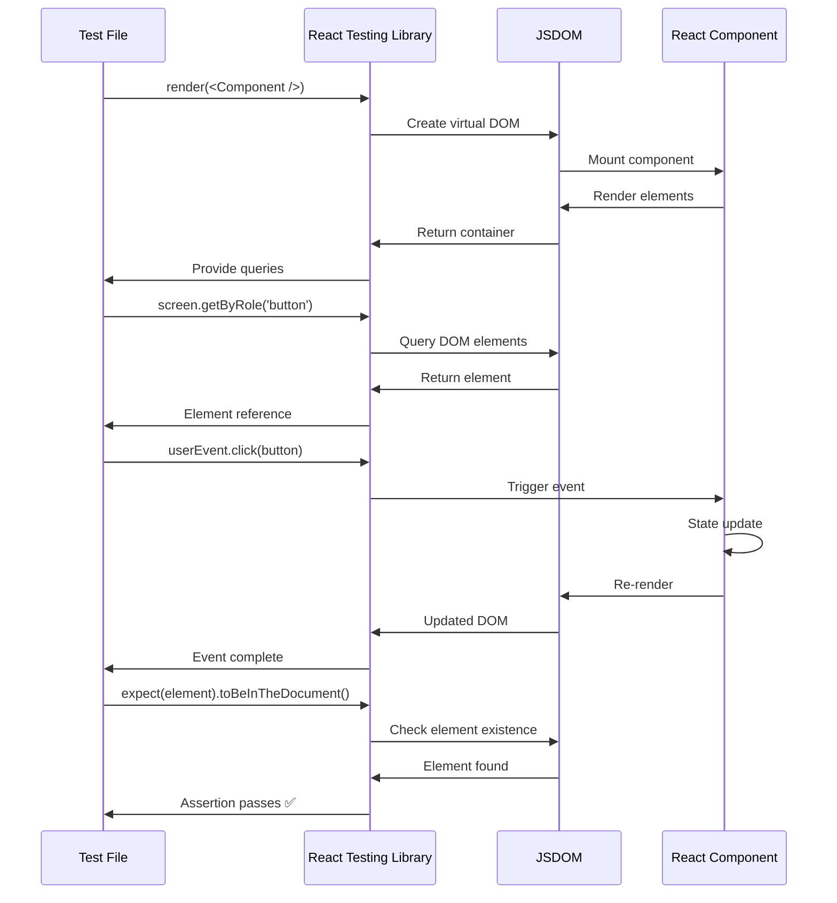
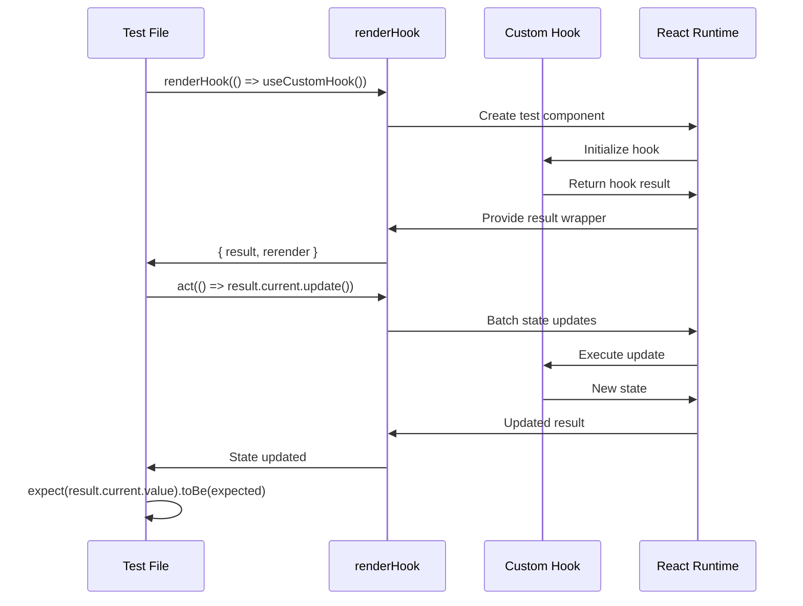

# React Testing Library Setup Flow & Architecture

## 🏗️ Testing Architecture Overview

```mermaid
graph TB
    A[📁 Project Root] --> B[⚙️ Configuration Files]
    A --> C[📦 Dependencies]
    A --> D[🧪 Test Files]
    A --> E[📚 Documentation]

    B --> B1[vite.config.ts<br/>Test Configuration]
    B --> B2[src/test/setup.ts<br/>Global Test Setup]
    B --> B3[package.json<br/>Test Scripts]

    C --> C1[🔧 Core Testing]
    C --> C2[🎭 Mocking & Utils]
    C --> C3[📊 Coverage & UI]

    C1 --> C1a[vitest<br/>Test Runner]
    C1 --> C1b[@testing-library/react<br/>React Testing Utils]
    C1 --> C1c[@testing-library/jest-dom<br/>Custom Matchers]
    C1 --> C1d[@testing-library/user-event<br/>User Interactions]
    C1 --> C1e[jsdom<br/>DOM Environment]

    C2 --> C2a[vi.fn()<br/>Function Mocks]
    C2 --> C2b[vi.mock()<br/>Module Mocks]
    C2 --> C2c[renderHook<br/>Hook Testing]

    C3 --> C3a[@vitest/coverage-v8<br/>Coverage Reports]
    C3 --> C3b[@vitest/ui<br/>Test UI]

    D --> D1[🧩 Component Tests]
    D --> D2[🪝 Hook Tests]
    D --> D3[🔧 Utility Tests]
    D --> D4[📋 Form Tests]

    D1 --> D1a[App.test.tsx<br/>Basic Component]
    D1 --> D1b[UserList.test.tsx<br/>Complex Component]
    D2 --> D2a[hooks/index.test.ts<br/>Custom Hooks]
    D3 --> D3a[utils/index.test.ts<br/>Pure Functions]
    D4 --> D4a[ContactForm.test.tsx<br/>Form Validation]
```

## 🔄 Testing Flow Diagram

```mermaid
flowchart TD
    Start([🚀 Start Testing]) --> Setup[⚙️ Setup Phase]
    
    Setup --> Config{📋 Load Config}
    Config --> ViteConfig[vite.config.ts<br/>• Test environment: jsdom<br/>• Global test setup<br/>• Coverage config]
    Config --> TestSetup[src/test/setup.ts<br/>• Import @testing-library/jest-dom<br/>• Global test utilities]
    
    ViteConfig --> Runner[🏃 Vitest Test Runner]
    TestSetup --> Runner
    
    Runner --> Discover[🔍 Test Discovery]
    Discover --> Pattern{📁 Find *.test.{ts,tsx}}
    
    Pattern --> ComponentTests[🧩 Component Tests]
    Pattern --> HookTests[🪝 Hook Tests]
    Pattern --> UtilTests[🔧 Utility Tests]
    
    ComponentTests --> CTFlow[Component Test Flow]
    HookTests --> HTFlow[Hook Test Flow]
    UtilTests --> UTFlow[Utility Test Flow]
    
    CTFlow --> CT1[1️⃣ Render Component]
    CT1 --> CT2[2️⃣ Query Elements]
    CT2 --> CT3[3️⃣ User Interactions]
    CT3 --> CT4[4️⃣ Assert Results]
    CT4 --> CT5[5️⃣ Cleanup]
    
    HTFlow --> HT1[1️⃣ renderHook()]
    HT1 --> HT2[2️⃣ act() for updates]
    HT2 --> HT3[3️⃣ Assert hook state]
    HT3 --> HT4[4️⃣ Test side effects]
    HT4 --> HT5[5️⃣ Cleanup]
    
    UTFlow --> UT1[1️⃣ Call Function]
    UT1 --> UT2[2️⃣ Assert Output]
    UT2 --> UT3[3️⃣ Test Edge Cases]
    UT3 --> UT4[4️⃣ Mock Dependencies]
    UT4 --> UT5[5️⃣ Verify Calls]
    
    CT5 --> Results
    HT5 --> Results
    UT5 --> Results
    
    Results[📊 Collect Results]
    Results --> Coverage[📈 Coverage Report]
    Results --> Report[📋 Test Report]
    
    Coverage --> End([✅ Testing Complete])
    Report --> End
```

## 📦 Dependencies Added & Their Purpose

### Core Testing Dependencies

```json
{
  "devDependencies": {
    "vitest": "^4.0.6",
    "@testing-library/react": "^16.3.0",
    "@testing-library/dom": "^10.4.1",
    "@testing-library/jest-dom": "^10.4.1",
    "@testing-library/user-event": "^14.5.1",
    "jsdom": "^22.1.0",
    "@vitest/ui": "^1.0.0",
    "@vitest/coverage-v8": "^1.0.0"
  }
}
```

### 🔧 Dependency Breakdown

| Dependency | Purpose | Why Needed |
|------------|---------|------------|
| **vitest** | Modern test runner | ✅ Faster than Jest<br/>✅ Native ESM support<br/>✅ TypeScript built-in<br/>✅ Vite integration |
| **@testing-library/react** | React testing utilities | ✅ Component rendering<br/>✅ Query utilities<br/>✅ User-centric testing |
| **@testing-library/jest-dom** | Custom matchers | ✅ `toBeInTheDocument()`<br/>✅ `toHaveClass()`<br/>✅ DOM assertions |
| **@testing-library/user-event** | User interactions | ✅ Realistic user events<br/>✅ Async event handling<br/>✅ Keyboard/mouse simulation |
| **jsdom** | DOM environment | ✅ Browser-like environment<br/>✅ DOM manipulation in Node.js<br/>✅ Required for React testing |
| **@vitest/ui** | Test UI dashboard | ✅ Visual test runner<br/>✅ Real-time results<br/>✅ Debug interface |
| **@vitest/coverage-v8** | Coverage reporting | ✅ Code coverage analysis<br/>✅ HTML reports<br/>✅ CI/CD integration |

## 🛠️ Configuration Files

### 1. `vite.config.ts` - Test Configuration
```typescript
/// <reference types="vitest" />
import { defineConfig } from 'vite'
import react from '@vitejs/plugin-react'

export default defineConfig({
  plugins: [react()],
  test: {
    globals: true,           // Global test functions
    environment: 'jsdom',    // Browser-like environment
    setupFiles: './src/test/setup.ts',  // Global setup
    css: true,              // CSS support in tests
    coverage: {
      provider: 'v8',       // Fast coverage
      reporter: ['text', 'json', 'html'],
      exclude: [
        'node_modules/',
        'src/test/',
        '**/*.d.ts'
      ]
    }
  },
})
```

### 2. `src/test/setup.ts` - Global Test Setup
```typescript
import '@testing-library/jest-dom'  // Custom matchers
```

### 3. `package.json` - Test Scripts
```json
{
  "scripts": {
    "test": "vitest",                    // Watch mode
    "test:ui": "vitest --ui",           // UI mode
    "test:coverage": "vitest --coverage" // With coverage
  }
}
```

## 🧪 Testing Patterns & Flow

### 1. Component Testing Flow


### 2. Hook Testing Flow


## 📋 Test File Structure

### Component Test Structure
```typescript
// ContactForm.test.tsx
describe('ContactForm Component', () => {
  beforeEach(() => {
    // Setup before each test
  })

  it('renders form fields', () => {
    // 1. Arrange - Setup test data
    // 2. Act - Render component
    // 3. Assert - Check results
  })

  it('validates user input', async () => {
    // 1. Arrange - Setup user and component
    // 2. Act - User interactions
    // 3. Assert - Validation results
  })
})
```

### Hook Test Structure
```typescript
// hooks/index.test.ts
describe('useCounter Hook', () => {
  it('initializes with default value', () => {
    // 1. Arrange - Setup hook
    // 2. Act - Call renderHook
    // 3. Assert - Check initial state
  })

  it('increments count', () => {
    // 1. Arrange - Render hook
    // 2. Act - Call increment function
    // 3. Assert - Check updated state
  })
})
```

## 🎯 Testing Best Practices Implemented

### 1. Query Priority (Accessibility First)
```typescript
// ✅ Preferred (Accessible)
screen.getByRole('button', { name: /submit/i })
screen.getByLabelText(/email/i)
screen.getByText(/welcome/i)

// ⚠️ Use when needed
screen.getByTestId('submit-button')

// ❌ Avoid (Implementation details)
screen.getByClassName('btn-primary')
```

### 2. User-Centric Interactions
```typescript
// ✅ Realistic user interactions
const user = userEvent.setup()
await user.type(input, 'test@example.com')
await user.click(button)

// ❌ Low-level events
fireEvent.change(input, { target: { value: 'test' } })
```

### 3. Async Testing
```typescript
// ✅ Proper async handling
await waitFor(() => {
  expect(screen.getByText(/loaded/i)).toBeInTheDocument()
})

// ✅ User events are async
await user.click(button)
```

## 🚀 Running Tests

### Command Options
```bash
# Watch mode (development)
npm test

# Single run (CI/CD)
npm test -- --run

# Coverage report
npm run test:coverage

# UI mode (debugging)
npm run test:ui

# Specific file
npm test -- ContactForm.test.tsx

# Pattern matching
npm test -- --grep "validation"
```

## 📊 Coverage & Reporting

### Coverage Types
- **Line Coverage**: % of code lines executed
- **Branch Coverage**: % of code branches taken
- **Function Coverage**: % of functions called
- **Statement Coverage**: % of statements executed

### Report Formats
- **HTML**: Interactive web report
- **JSON**: Machine-readable format
- **Text**: Terminal summary

## 🔍 Debugging Tests

### Common Debug Techniques
```typescript
// Visual debugging
screen.debug()  // Print current DOM

// Query debugging
screen.getByRole('')  // Shows available roles

// Async debugging
await waitFor(() => {
  expect(element).toBeInTheDocument()
}, { timeout: 5000 })

// Mock debugging
expect(mockFn).toHaveBeenCalledWith(expectedArgs)
```

This testing setup provides a comprehensive, modern, and maintainable testing foundation for React applications with full TypeScript support, accessibility-first approach, and industry best practices.